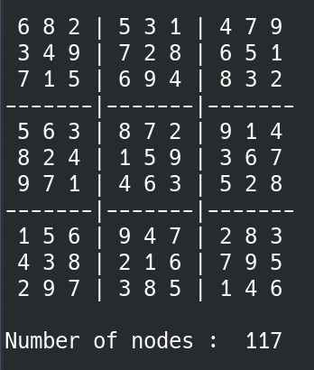

# Sudoku 9*9 with Python
A useful website to ceate and solve sudukos : [qqwing](https://qqwing.com/)

If you want to know about the algorithms and heuristics you should search the web or read 

`Artificial Intelligence: A Modern Approach Textbook by Peter Norvig and Stuart J. Russell`

## Section 1 : Backtrack and forward checking `1.backtrack_and_FC.py`

In this section we only have backtrack and forward checking algorithms.

## Section 2 : Minimum Remaining Values `2.mrv.py`

In this section we update the section 1 file with Minimum Remaining Values (MRV).

## Section 3 : Least constrained value `3.lcv.py`

In this section we update the section 2 file with Least constrained value (LCV).

## Section 4 : Arc Consistency Algorithm #3 `4.ac3.py`

In this section we update the section 3 file with Arc Consistency Algorithm #3 (AC-3) I don't use queue in this section.

## Section 5 : Arc Consistency Algorithm #3 Complete `5.ac3Comp.py`

In this section we update the section 4 file with Arc Consistency Algorithm #3 Complete (AC-3) I use queue to keep track of changed cells that need to be checked in AC-3 again.

## Sample inputs:

 The sample inputs are `input1` , `input2` and `input3` files, you can run the programms in UNIX with this:

```bash
python 2.mrv.py < input1
```
The `input1` file is an easy sudoku.

After section 3 the app is slow so it's better to use pypy instead:

```bash
pypy3 4.ac3.py < input1
```

## Sample output:

> pypy3 3.lcv.py < input2



## Empty sudoku

You can copy this to solve the empty sudoku:

"

.........

.........

.........

.........

.........

.........

.........

.........

.........

"
